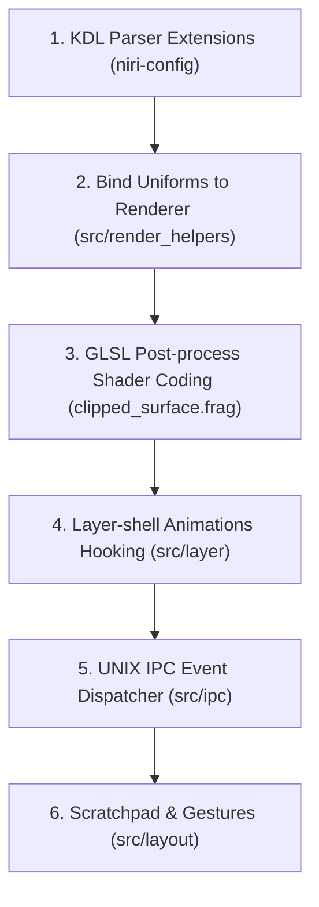

# Liquid Compositor (niri-liquid) Project Specification

This specification outlines the architecture, KDL syntax schema, rendering pipeline graph, and IPC control flows required to fork or extend the **niri** Wayland compositor into a material-driven window manager focused on Apple-like **Liquid Glassmorphism** and advanced structural physics.

---

## Conceptual Vision: "From Blurred Surface to Refractive Material"

Instead of treating transparency as a flat opacity filter with an independent Gaussian blur, `niri-liquid` models windows and layers as physical glass panes with thickness, refraction, dispersion, and dynamic light bending.

```
Window Texture (Base UI)
       │
       ▼
 ┌───────────┐     ┌──────────────┐     ┌─────────────┐
 │Refraction │ ──> │  Dispersion  │ ──> │Specular/Rim │ ──> Output
 └───────────┘     └──────────────┘     └─────────────┘
       ▲                  ▲                    ▲
[Normal Map (Lens)]  [RGB splitting]     [Lighting angle]
```

---

## 1. Core Feature Specification & KDL Schemas

### 1.1 Animation Tree & Profiles
States determine the dynamic behavior of animations. The compositor loads animation profiles that group different curves, speeds, and targets.

#### KDL Schema
```kdl
animation-profile {
    name "liquid"
    window-open "liquid-pop"
    window-close "liquid-melt"
    layer-open "slide-glass"
    overview-open "zoom-out"
}

animation-profile {
    name "battery"
    window-open "fast-fade"
    workspace "calm"
}
```

#### Rust Data Structure (`niri-config/src/animations.rs`)
```rust
#[derive(Debug, Clone, Serialize, Deserialize)]
pub struct AnimationProfile {
    pub name: String,
    pub window_open: Option<String>,
    pub window_close: Option<String>,
    pub layer_open: Option<String>,
    pub overview_open: Option<String>,
    pub workspace: Option<String>,
}
```

---

### 1.2 Material & Effect Pipeline
Instead of applying flat filters, we define `material` assets that configure the post-process shader graph parameters.

#### KDL Schema
```kdl
material "liquid-mocha" {
    blur {
        passes 6
        offset 6.0
    }
    tint "rgba(30, 30, 46, 0.17)"   // Base color blend
    saturation 1.8                  // Vivid color bleeding
    noise 0.01                      // Dithering grain

    refraction {
        strength 0.035
        edge-strength 0.06
        normal-noise 0.012
    }

    specular {
        strength 0.15
        angle 45.0
        width 0.2
    }

    edge-highlight {
        color "rgba(255, 255, 255, 0.22)"
        width 1.0
    }
}
```

---

### 1.3 Decoration & Effects as First-Class Concepts
Decorations are grouped into presets and referenced cleanly in window rules.

#### KDL Schema
```kdl
effect-preset "floating-glass" {
    material "liquid-mocha"
    corner-radius 14
    shadow "soft"
    border "mauve-sapphire"
}

window-rule {
    match app-id="ghostty"
    effect-preset "floating-glass"
}
```

---

### 1.4 Layer-shell Animation
Brings Wayland layer-shell surfaces (bars, desktop overlays, tooltips) into the animation engine.

#### KDL Schema
```kdl
layer-rule {
    match namespace="quickshell-dashboard"
    material "liquid-mocha"

    animation-open {
        style "scale-fade"
        from-scale 0.95
        duration-ms 140
        curve "ease-out-expo"
    }
    animation-close {
        style "fade-slide"
        direction "down"
        duration-ms 100
    }
}
```

---

### 1.5 Special Workspaces / Scratch-Columns
Niri's horizontal flow fits a "temporary lane" or "scratch-column" paradigm.

#### KDL Schema
```kdl
scratch-column "terminal" {
    width 0.50
    position "bottom" // Slides in from the bottom
    animation "popin"
}
```

---

### 1.6 Dispatcher API & UNIX IPC (`niri msg`)
Expose compositor parameters to control scripts and Quickshell through a reactive UNIX socket IPC.

#### Commands Example
```bash
niri msg action set-animation-profile showcase
niri msg action toggle-scratch-column terminal
niri msg action set-material liquid-mocha
```

---

### 1.7 Event Hooks (Dispatcher Scripting)
Trigger external processes, notifying the desktop shell (Quickshell) of workspace shifts or mode changes.

#### KDL Schema
```kdl
hook {
    on-window-open "notify-window-open"
    on-mode-change "quickshell-mode-sync"
    on-overview-open "quickshell-dim-elements"
}
```

---

### 1.8 Interactive Gestures (Swipe to Reveal)
Animations track gesture progress directly (Apple style "interactive pull" instead of linear triggers).

#### KDL Schema
```kdl
gesture-edge "left" {
    action "toggle-left-dock"
    reveal-ratio 0.85
    interactive true
}
```

---

## 2. Rendering Pipeline Graph (GLSL & GLES2)

A clean compositing chain requires resolving the background texture in coordinates displaced by the normal maps.

```
       [Backdrop Framebuffer (Screen Behind)]
                         │
                         ▼
             [Liquid Material Shader]
             ├─ 1. Displace UVs (Refraction)
             ├─ 2. Shift Channels (Aberration)
             ├─ 3. Saturation & Noise
             └─ 4. Specular & Rim Highlight
                         │
                         ▼
           [Blend original Window Texture]
                         │
                         ▼
             [Round Corner Clip Pass]
                         │
                         ▼
                    [Output Color]
```

---

## 3. Implementation Roadmap



### Phase 1: Configuration & Parser (niri-config)
Extend KDL decoders in `niri-config/src/appearance.rs` to allow the syntax definitions of materials and presets without configuration load crashes.

### Phase 2: Refractive Shader Development (GLSL)
Extend `clipped_surface.frag` and `postprocess.frag` in `src/render_helpers/shaders/`. Implement the refraction vector field calculations, dispersion offset, and 1px edge rim highlights.

### Phase 3: Layer-Shell Animations
Introduce transitions for Wayland layer-shell surfaces by storing target geometry coordinates inside `src/layer/layer_surface.rs` and animating them during layout draws.

### Phase 4: Shell Integration (Quickshell IPC)
Add UNIX socket message routes in `src/ipc/` and update `niri-ipc` APIs to trigger visual profile swaps.
